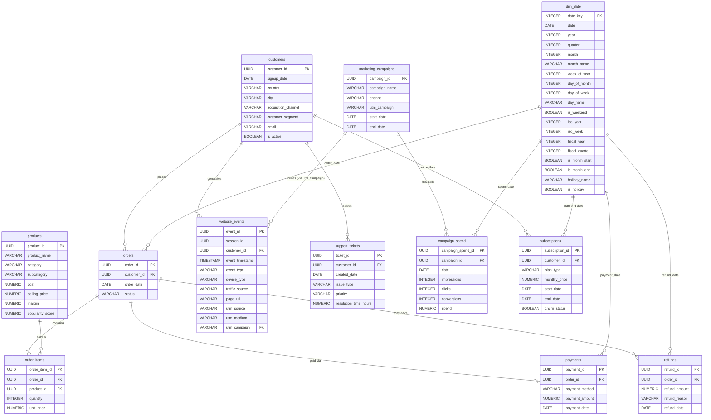

# ShopSphere Entity Relationship Diagram

```mermaid
erDiagram
    customers {
        UUID customer_id PK
        DATE signup_date
        VARCHAR country
        VARCHAR city
        VARCHAR acquisition_channel
        VARCHAR customer_segment
        VARCHAR email
        BOOLEAN is_active
    }

    products {
        UUID product_id PK
        VARCHAR product_name
        VARCHAR category
        VARCHAR subcategory
        NUMERIC cost
        NUMERIC selling_price
        NUMERIC margin
        NUMERIC popularity_score
    }

    orders {
        UUID order_id PK
        UUID customer_id FK
        DATE order_date
        VARCHAR status
    }

    order_items {
        UUID order_item_id PK
        UUID order_id FK
        UUID product_id FK
        INTEGER quantity
        NUMERIC unit_price
    }

    payments {
        UUID payment_id PK
        UUID order_id FK
        VARCHAR payment_method
        NUMERIC payment_amount
        DATE payment_date
    }

    refunds {
        UUID refund_id PK
        UUID order_id FK
        NUMERIC refund_amount
        VARCHAR refund_reason
        DATE refund_date
    }

    website_events {
        UUID event_id PK
        UUID session_id
        UUID customer_id FK
        TIMESTAMP event_timestamp
        VARCHAR event_type
        VARCHAR device_type
        VARCHAR traffic_source
        VARCHAR page_url
        VARCHAR utm_source
        VARCHAR utm_medium
        VARCHAR utm_campaign FK
    }

    support_tickets {
        UUID ticket_id PK
        UUID customer_id FK
        DATE created_date
        VARCHAR issue_type
        VARCHAR priority
        NUMERIC resolution_time_hours
    }

    marketing_campaigns {
        UUID campaign_id PK
        VARCHAR campaign_name
        VARCHAR channel
        VARCHAR utm_campaign
        DATE start_date
        DATE end_date
    }

    campaign_spend {
        UUID campaign_spend_id PK
        UUID campaign_id FK
        DATE date
        INTEGER impressions
        INTEGER clicks
        INTEGER conversions
        NUMERIC spend
    }

    subscriptions {
        UUID subscription_id PK
        UUID customer_id FK
        VARCHAR plan_type
        NUMERIC monthly_price
        DATE start_date
        DATE end_date
        BOOLEAN churn_status
    }

    dim_date {
        INTEGER date_key PK
        DATE date
        INTEGER year
        INTEGER quarter
        INTEGER month
        VARCHAR month_name
        INTEGER week_of_year
        INTEGER day_of_month
        INTEGER day_of_week
        VARCHAR day_name
        BOOLEAN is_weekend
        INTEGER iso_year
        INTEGER iso_week
        INTEGER fiscal_year
        INTEGER fiscal_quarter
        BOOLEAN is_month_start
        BOOLEAN is_month_end
        VARCHAR holiday_name
        BOOLEAN is_holiday
    }

    %% Relationships
    customers ||--o{ orders : "places"
    customers ||--o{ website_events : "generates"
    customers ||--o{ support_tickets : "raises"
    customers ||--o{ subscriptions : "subscribes"

    orders ||--|{ order_items : "contains"
    orders ||--o| payments : "paid via"
    orders ||--o{ refunds : "may have"

    products ||--o{ order_items : "sold in"

    marketing_campaigns ||--o{ campaign_spend : "has daily"
    marketing_campaigns ||--o{ website_events : "drives (via utm_campaign)"

    dim_date ||--o{ orders : "order_date"
    dim_date ||--o{ payments : "payment_date"
    dim_date ||--o{ refunds : "refund_date"
    dim_date ||--o{ campaign_spend : "spend date"
    dim_date ||--o{ subscriptions : "start/end date"
```
